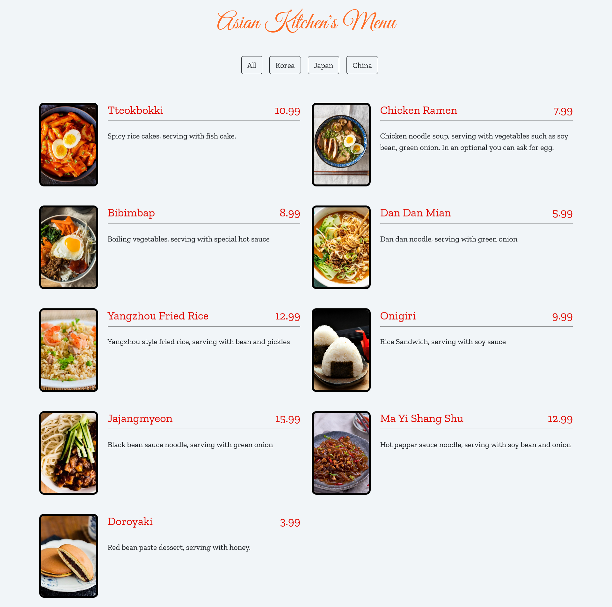

# Asian Kitchen's Menu Website with JavaScript

Here is how it looks:

### I enjoyed learning web developing with [Kodluyoruz & Patika](https://app.patika.dev/paths). I'd say check their content out.

## About Asian Cuisine

Asian cuisine includes several major regional cuisines: Central Asian, East Asian, North Asian, South Asian, Southeast Asian, and West Asian. A cuisine is a characteristic style of cooking practices and traditions,usually associated with a specific culture. Asia, being the largest and most populous continent, is home to many cultures, many of which have their own characteristic cuisine.

Ingredients common to many cultures in the East and Southeast regions of the continent include rice, ginger, garlic, sesame seeds, chilies, dried onions, soy, and tofu. Stir frying, steaming, and deep frying are common cooking methods.

While rice is common to most Asian cuisines, different varieties are popular in the various regions. Glutinous rice is ingrained in the culture, religious tradition and national identity of Laos. Basmati rice is popular in the Indian subcontinent, jasmine rice is often found across Southeast Asia, while long-grain rice is popular in China and short-grain in Japan and Korea.

Curry is a common dish in South Asia, Southeast Asia, and East Asia. Curry dishes have their origins in the Indian subcontinent, with present-day Northern India, Bangladesh, and Pakistan mainly using a yogurt base, while those in present-day Southern India, Sri Lanka, and Southeast Asia generally use coconut milk as their foundation.

